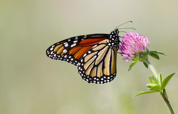

<link rel="stylesheet" href="email_style.css"/>

```{r echo = FALSE, include = FALSE}
library(tidyverse)
library(lubridate)
library(gt)
library(htmltools)
source("email_functions.R")

start <- format(today() - 6, "%d %B %Y")
end <- format(today(), "%d %B %Y")

# ## Pull iNaturalist and eBird data
# inat <- inat_recent("49610")
# ebird <- ebird_recent("US-ME-009", "Acadia National Park")
# 
# 
# ## Combine the two data frames
# final_data <- combine_citsci_data(inat, ebird)

final_data <- read.csv("weeks_data.csv")

watchlist_species(final_data, "outputs")

pests <- read.csv("outputs/invasive_pestslist.csv") %>% 
  select(scientific.name, common.name, user = user.login, observed.on, url)
rare <- read.csv("outputs/rare_specieslist.csv")
te <- read.csv("outputs/te_specieslist.csv")

```


<!-- Header -->
<div style = "
  text-align: center; 
  padding: 3px 0;
  background-image: linear-gradient(240deg, rgba(146, 206, 208, 1), rgba(85, 143, 94, 1));
  border-radius: 5px;
  ">
  
<div style = "
  color: rgba(13, 4, 42, 1); 
  font-size: 30px; 
  font-weight: 700;
  "> 
Citizen Science Report
</div>

<div style = "
  color: rgba(13, 4, 42, 1); 
  font-size: 20px; 
  font-weight: 500;
  "> 
Acadia National Park
</div>

</div>


<!-- Introduction -->
<div style = "
  position: relative;
  margin: 20px auto;
  height: 200px;
  width: 300px;
  border-radius: 5px;
  box-shadow: 3px 2px 1rem rgba(0, 0, 0, 0.2);
  ">

</div>
  
<div style = "
  color: rgba(13, 4, 42, 1);
  ">
Welcome to the weekly report of iNaturalist and eBird records. These are all observations submitted from `r start` to `r end` for the species that you have identified as being of particular interest. The data for this report comes from open source citizen science projects: iNaturalist and eBird.
</div>


```{r echo = FALSE}
pests %>%
  mutate(link = glue::glue("[view observation]({url})"),
         link = map(link, gt::md)) %>%
  select(-url) %>% 
  gt()
```
