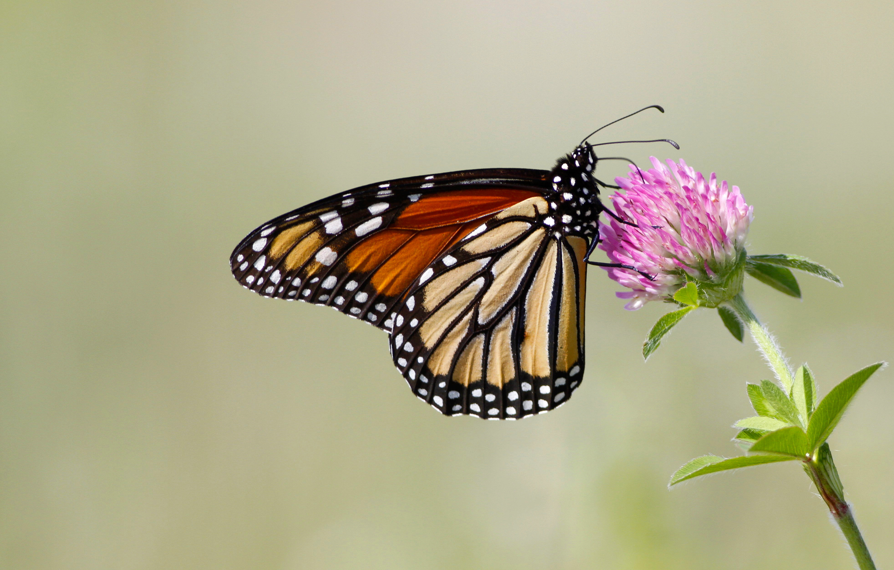

<link rel="stylesheet" href="email_style.css"/>

```{r echo = FALSE, include = FALSE}
library(tidyverse)
library(lubridate)

start <- format(today() - 7, "%d %B %Y")
end <- format(today() - 1, "%d %B %Y")
year <- format(today(), "%Y")

```


<!-- Header -->
<div style = "
  text-align: center; 
  padding: 3px 0;
  background-image: linear-gradient(240deg, rgba(146, 206, 208, 1), rgba(85, 143, 94, 1));
  border-radius: 5px;
  ">
  
<div style = "
  color: rgba(13, 4, 42, 1); 
  font-size: 30px; 
  font-weight: 700;
  "> 
Citizen Science Report - Acadia National Park
</div>

<div style = "
  color: rgba(13, 4, 42, 1); 
  font-size: 20px; 
  font-weight: 500;
  "> 
`r start` - `r end`
</div>

</div>


<!-- Introduction -->
<div style = "
  position: relative;
  margin: 20px auto;
  height: 200px;
  width: 300px;
  border-radius: 5px;
  ">

</div>
  
<div style = "
  color: rgba(13, 4, 42, 1);
  font-size: 16px;
  ">
The weekly report has been updated! This report summarizes iNaturalist and eBird records of the species that you have identified as being of management interest. Click the button below to view the report.
</div>


<!-- Button -->
<div style = "
  position: relative;
  margin: 60px auto;
  text-align: center;
  ">
<a href = "https://schoodicinstitute.org/" style = "
  position: relative;
  font-size: 20px;
  font-weight: 500;
  color: rgba(146, 206, 208, 1);
  background-color: rgba(13, 4, 42, 1);
  text-decoration: none;
  padding: 10px 20px;
  border-radius: 100vmax;
  ">
Go to the report!
</a>
</div>


<!-- End -->
<!-- <div style = " -->
<!--   color: rgba(13, 4, 42, 1); -->
<!--   font-size: 14px; -->
<!--   margin-bottom: 20px; -->
<!--   text-align: center; -->
<!--   "> -->
<!-- Schoodic Institute at Acadia National Park, `r year` -->
<!-- </div> -->


<div style = "
  position: relative;
  margin: 30px auto;
  height: 100px;
  width: 200px;
  border-radius: 5px;
  ">

</div>


