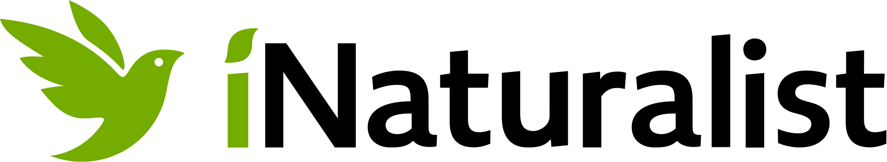

```{r echo = FALSE, include = FALSE}
library(tidyverse)
library(lubridate)
library(kableExtra)
library(htmltools)
library(gt)
source("email_alerts/email_functions.R")

start <- format(today() - 7, "%d %B %Y")
end <- format(today()-1, "%d %B %Y")

## Pull iNaturalist and eBird data
inat <- inat_recent("49610")
ebird <- ebird_recent("US-ME-009", "Acadia National Park")

## Combine the two data frames
final_data <- combine_citsci_data(inat, ebird)

# final_data <- read.csv("email_alerts/weeks_data.csv")

## Run the summary function on the final data
watchlist_species(final_data, "email_alerts/outputs")

pests <- read.csv("email_alerts/outputs/invasive_pestslist.csv") %>% 
  select(scientific.name, common.name, user = user.login, observed.on, url) %>% 
  mutate(link = glue::glue("[view observation]({url})"),
         link = map(link, gt::md)) %>%
  select(-url)

rare <- read.csv("email_alerts/outputs/rare_specieslist.csv") %>% 
  select(scientific.name, common.name, observed.on = date, url) %>% 
  mutate(link = glue::glue("[view observation]({url})"),
         link = map(link, gt::md)) %>%
  select(-url)


te <- read.csv("email_alerts/outputs/te_specieslist.csv") %>% 
  select(scientific.name, common.name, listing.status, observed.on, url) %>% 
  mutate(link = glue::glue("[view observation]({url})"),
         link = map(link, gt::md)) %>%
  select(-url)

```


<!-- Header -->
<div class = "title-box">
  <div class = "titlemain">
  Citizen Science Report
  </div>
  <div class = "titlemain2">
  Acadia National Park
  </div>
  <div class = "subtitle"> 
  `r start` - `r end`
  </div>
</div>


<!-- Introduction -->
<div class = "intro-box">
  <div class = "body-title-box">
  <i class = "body-box-icon"></i>
  <h4 class = "body-titles"> Introduction </h4>
  </div>
  <div class = "intro-img-box">
  <a href = "https://www.inaturalist.org/"></a>
  <a href = "https://ebird.org/"></a>
  </div>
  <div class = "intro-text">
  Welcome to the weekly report of iNaturalist and eBird records. These are all observations submitted    from `r start` to `r end` for the species that you have identified as being of particular interest.
  The data for this report comes from open source citizen science projects: iNaturalist and eBird. The   records here are both casual and research grade observations, so erroneous identifications are        possible.
  </div>
</div>


<!-- Pests -->
<div class = "pests-box">
  <div class = "body-title-box">
  <i class = "body-box-icon"></i>
  <h4 class = "body-titles"> Pest Species </h4>
  </div>
  <div class = "pests-img-box">
  
  </div>
  <div class = "pests-table">
  `r ifelse(length(pests$scientific.name) > 0, kbl(pests) %>% kable_styling(bootstrap_options = "hover"), paste0("<h3> There were no pest species reported this week. </h3>"))`
  </div>
</div>


<!-- Threatened and Endangered -->
<div class = "te-box">
  <div class = "body-title-box">
  <i class = "body-box-icon"></i>
  <h4 class = "body-titles"> Threatened & Endangered Species </h4>
  </div>
  <div class = "te-img-box">
  
  </div>
  <div class = "te-table">
  `r ifelse(length(te$scientific.name) > 0, kbl(te) %>% kable_styling(bootstrap_options = "hover"), paste0("<h3> There were no threatened or endangered species reported this week. </h3>"))`
  </div>
</div>


<!-- Rare species -->
<div class = "rare-box">
  <div class = "body-title-box">
  <i class = "body-box-icon"></i>
  <h4 class = "body-titles"> Rare Species </h4>
  </div>
  <div class = "rare-img-box">
  
  </div>
  <div class = "rare-table">
  `r ifelse(length(rare$scientific.name) > 0, kbl(rare) %>% kable_styling(bootstrap_options = "hover"), paste0("<h3> There were no rare species reported this week. </h3>"))`
  </div>
</div>


<!-- Credits -->
<div class = "credits-box">
  <div>
  <a href = "https://schoodicinstitute.org/"></a>
  <h5 class = "credits-text"> This page was created by Schoodic Institute at Acadia National Park       </h5>
  </div>
  <div class = "credits-text">
  <h5> Photo credits: </h5>
  <h5> Acadia landscape by Ben Tero </h5>
  <h5> Hemlock Wolly Adelgid by jesse94 </h5>
  <h5> Red Knot by Fyn Kynd </h5>
  <h5> Nodding Trillium by Kristen_smith2 </h5>
  </div>
</div>
